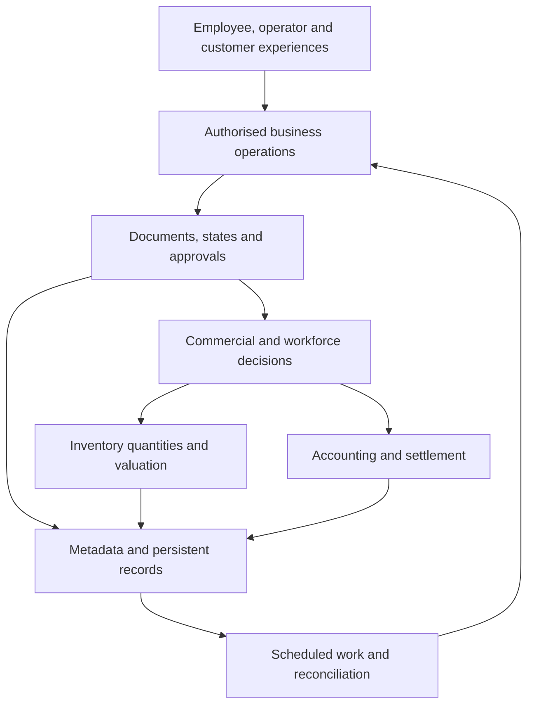

# Enterprise Application Behavioural Blueprint

This repository specifies a unified enterprise application through its observable decisions, records, calculations, permissions, transactions, and business consequences. It is intended for an independent implementation without assuming an implementation language, framework, database product, hosting topology, or prior knowledge of the reference system.

The reference boundary is the four supplied source snapshots, including their shared application foundation. Current accounting, distribution, manufacturing, customer relationships, workforce, payroll, projects, support, and shared administration form one specification. Historical upgrade procedures, deprecated compatibility shims, product deployment recipes, and a prospective implementation platform are outside this boundary. An actively selectable behaviour remains in scope even if it has existed for many years.

## Architecture at a glance

A transaction can change operational progress, inventory value, financial balances, party settlements, and employee entitlements together. Recreating screens and record tables without these effects does not establish equivalent behaviour.

## Start here

| Purpose | Reading path |
|---|---|
| Understand the full boundary | [Scope and source baseline](docs/overview/scope-and-baseline.md), then [business compatibility map](docs/overview/business-compatibility-map.md) |
| Understand the architecture | [Application architecture](docs/overview/application-architecture.md), then [cross-domain transactions](docs/domains/cross-domain-transactions.md) |
| Rebuild records and calculations | [Domain model](docs/data/domain-model.md), [physical data catalog](docs/data/physical-data-catalog.md), then the [mathematical catalog](schemas/mathematics/README.md) |
| Rebuild user and service behaviour | [Interfaces](docs/interfaces/README.md) and [runtime semantics](docs/runtime/README.md) |
| Plan and verify an implementation | [Reimplementation sequence](docs/reimplementation/sequence.md), [acceptance strategy](docs/reimplementation/acceptance-strategy.md) |
| Assess the evidence and remaining uncertainty | [Coverage and evidence](docs/references/coverage-and-evidence.md) and [source traceability](schemas/traceability/README.md) |
| Find every document | [Documentation index](docs/README.md) |
| Consume structured specifications | [Machine-readable catalogs](schemas/README.md) |

## Definition of compatibility

Compatibility means the same supported operation, input, configuration, prior records, identity, and effective time produce the same accept-or-reject decision, persisted facts, state transitions, amounts, quantity consequences, and externally visible completion or failure. Exact source-language identifiers and branded transport paths are replaced with neutral names. Existing clients expecting those literal names require an adapter; this repository specifies semantic compatibility rather than claiming a byte-for-byte reproduction of named routes.

Each rule distinguishes observed source behaviour, a derived example, and a proposed improvement. An apparent anomaly is retained as a compatibility finding until resolved. Industry convention never silently replaces a contradictory source decision.

## Evidence and completeness

The structural baseline contains **1,044 record definitions and 16,813 declared fields**, including layout fields, child records, and settings records. Source inventory, field inventory, semantic review, numerical example checks, and execution against a running reference application are separate measures. Consult the coverage report before making an equivalence claim. Cataloging a function or a record does not establish that all of its decisions have been specified or executed.

The specification contains original explanatory prose and neutral structured facts. Source archives and source implementation code are not included. The unchanged repository license is [Apache License, Version 2.0](LICENSE).
