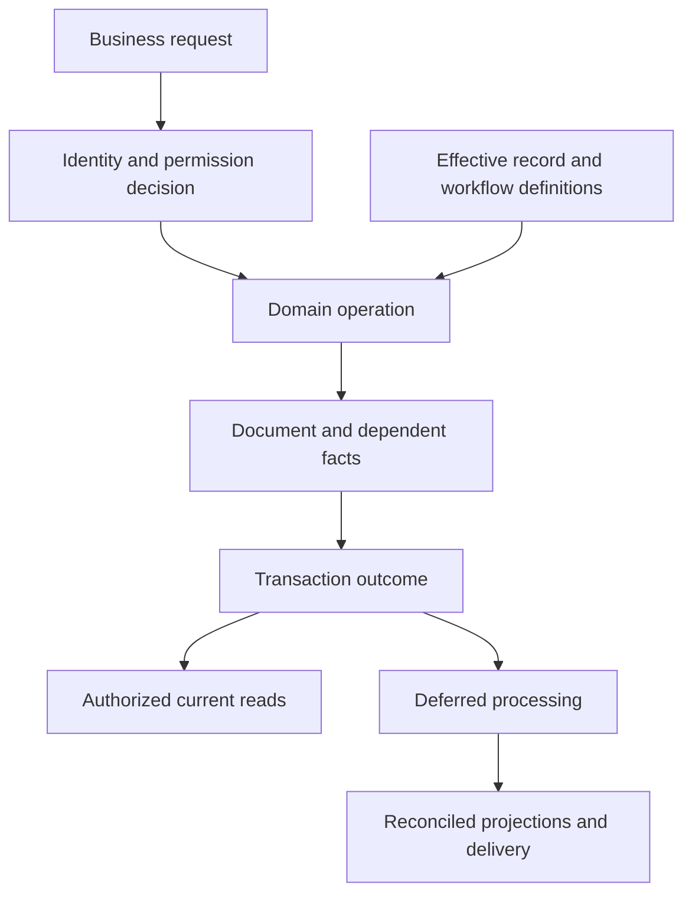

# Application architecture

## Architectural model

The application is a metadata-governed system of documents and services. A record definition describes fields, relationships, parent-owned rows, presentation metadata, permissions and lifecycle capabilities. Business controllers and composed extensions add decisions that cannot be represented by field metadata alone. Screens, remote operations, scheduled jobs and integration handlers invoke these same domain operations, although their authentication and error envelopes differ.

A faithful replacement must distinguish these layers:

| Layer | Responsibility | Observable contract |
|---|---|---|
| Experience | Forms, lists, dashboards, workspaces, portals and mobile interactions | Available actions, field visibility, warnings, user tasks and progress |
| Transport | Requests, uploads, background submission and notifications | Authentication, argument handling, output shape and failure classification |
| Application service | Orchestrated use case and transaction ownership | Preconditions, permission checks, dependency order and success boundary |
| Domain policy | Calculation, validation, state and accounting decisions | Deterministic rules for the same effective inputs |
| Record runtime | Identity, metadata, persistence and lifecycle | Parent-child integrity, submitted-state restrictions and revision checking |
| Projection and processing | Balances, progress, reports, scheduled work and reconciliation | Timely derived state with visible pending and failed work |

These are logical responsibilities. The replacement may place them in one process or many without changing the business contract.

## Four distinct state families

Document lifecycle distinguishes draft, submitted and cancelled records, with additional discard and amendment operations where supported. Business status independently expresses states such as open, on hold, partly received or completed. Settlement state expresses unpaid, partly paid, paid, unreconciled or advance allocation conditions. Background processing state expresses queued, running, completed, retrying or failed work.

A submitted sales order can therefore be on hold, partly delivered, partly billed and partly paid at the same time. A cancelled invoice can retain reversal records. A received item can be awaiting final valuation. Combining these into one status loses information.

## Transaction architecture

A service operation validates identity and permissions, loads the authoritative record state, checks dependencies, calculates consequences, persists the document and dependent records, and schedules any after-commit work. The exact event order and transaction boundaries are specified in [document lifecycle and transactions](../runtime/document-lifecycle-and-transactions.md).

Inventory movement and financial movement are related but not identical. A reservation changes availability without posting an inventory movement. A purchase receipt can establish value and an accrued liability before an invoice exists. An invoice can recognise a party balance without moving stock when the movement already occurred. Payment can settle a party balance without changing revenue. See [cross-domain transactions](../domains/cross-domain-transactions.md).

## Metadata as active behaviour

Metadata can enforce required values, precision, allowed options, relationships, role permissions, workflow transitions and submitted-field editability. Presentation hints can be weaker than server validation; a hidden or read-only field is not automatically immutable in storage. Link targets can depend on another field, and child records are owned through both parent identity and parent collection. Single-instance settings records have different persistence from ordinary records.

Changing metadata can affect queries, forms, serialisation, permission checks and business validation. The replacement needs a coherent metadata publication boundary: all participating paths must agree on the active definition used for a transaction. The particular cache or distribution mechanism is an implementation choice.

## Extension composition

Current extensions add behaviour to employee, project, time record, payment, contact and communication records. Additional event handlers run on shared records. The unified model must compose these responsibilities instead of accidentally replacing the base financial or permission behaviour.

For example, a payment can update an employee expense claim; a journal cancellation can remove a payroll reference; a contact change can refresh lead phone details; a product change can synchronise a commercial product projection. The ordered composition and any uncertain application-order effects belong in acceptance tests. The [unified distribution model](#unified-distribution-model) lists the shared boundaries and the responsibilities that must compose. A payment extension must retain the base balanced settlement while updating the employee expense relationship, and cancellation must reverse the applicable dependent references.

## Reports and consistency

Transactional records, journals, stock movement records, party settlement records and change histories are facts. Outstanding amounts, projected quantities, progress percentages and many reports are derived from those facts and explicit policies. A replacement may materialise projections for performance, but must retain a way to reconcile them and expose unfinished recalculation rather than presenting stale results as final.

Do not infer that all source projections are maintained by one uniform mechanism. Some update synchronously, some through hooks and others through background processing. The relevant domain specification determines the required completion boundary.

## Authoritative interaction boundaries

The operation owns the business decision; its transaction owns the defined durable fact set. Metadata supplies active constraints, but domain validation still determines account suitability, quantity limits, period permissions, and financial effects. Deferred processing can update projections or deliver external events without turning an earlier queued acknowledgement into proof of completion.

## Unified distribution model

The combined system shares product, party, person, company, project, communication, and financial identities. Customer activity, workforce administration, and enterprise transactions remain distinct responsibilities within that integrated model. Overlapping screens can become one experience, while different business roles retain their necessary records and permissions.

| Shared boundary | Responsibilities that must compose |
| --- | --- |
| Product and commercial catalog | Stock units, variants, conversion, valuation, taxes, sales-facing rate and description |
| Person and login | Authentication, employee identity, contact channels, customer relationships, privacy |
| Payment and employee expenses | Balanced settlement, employee/party allocation, advance adjustment, claim state |
| Journal and payroll | Posting, payroll association, cancellation cleanup, currency and dimensions |
| Time and project | Actual time, billing time, costing, invoicing, progress and payroll-related use |
| Communication and service | Party links, issue timelines, response clocks, campaign delivery, call history |

A unified implementation may eliminate internal synchronization between duplicate projections. It must preserve the ownership and conflict rules that synchronization previously enforced. For example, a sales-facing product edit cannot erase inventory valuation policy, and a contact telephone update cannot create a second employee or customer identity.

## Replacement sequence and completion gates

First implement [identity and persistence](../data/persistence-identity-and-values.md), [effective configuration](../runtime/extensibility-and-configuration.md), and [permissions](../runtime/identity-permissions-and-tenancy.md). Then implement the [document lifecycle and transactions](../runtime/document-lifecycle-and-transactions.md) with verified rollback and concurrency boundaries. Build financial and stock domains on those common guarantees, followed by commercial, workforce, service, project, and integration workflows with their shared consequences.

A domain is behaviorally complete only when its records, decision rules, calculations, exceptions, state transitions, authorized services, projections, and acceptance outcomes are all specified and verified to the declared level. A structural catalog is complete only for the definitions it enumerates. An endpoint inventory proves discovery, not financial correctness. Execution-dependent or provider-dependent behavior must remain identified until it has a measured fixture; documented proposed improvements must not be relabelled as observed behavior.

The [domain model](../data/domain-model.md) defines shared business ownership, the [service matrix](../interfaces/service-contracts.md#operation-contract-matrix) defines reusable operations, and [background processing](../runtime/background-work-and-consistency.md) defines delayed completion and recovery. These repository-local contracts are the implementation references; no external code listing is required to follow their rules.
